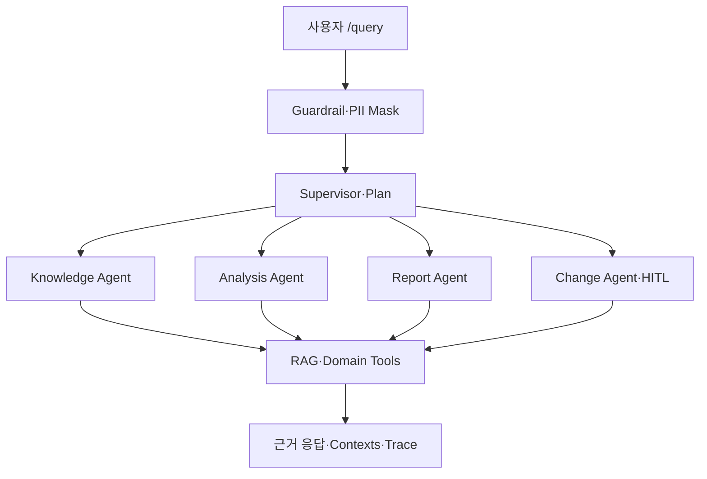

# 미니 PJT: Performance Station AI

Performance Station 사용법·성능테스트 기본 개념부터, 표준·측정 지표·과거 장애를 근거로 한 KPI 계산·병목 가설·확인 순서·보고까지 만드는 성능검증 Agentic RAG Copilot이다. 위험한 운영 변경은 계획까지만 만들고 승인을 기다린다.

## 무엇을 푸나

Performance Station 사용법과 성능검증 자료가 여러 문서에 흩어져 있어 신규 사용자가 반복 문의하던 문제를, 근거 검색 → Tool 실행 → 전문 Agent 판단 → 추적 가능한 답변의 한 흐름으로 줄인다.

대표 질문:

- `Performance Station은 어떻게 시작해? 로그인하고 나면 뭐부터 봐야 해?`
- `104 TPS에 응답시간 1초 Think Time 30초면 VUser가 몇 명 필요해?`
- `PAY-LOAD-001의 병목 원인을 분석해줘`
- `KDB-HA-001 가용성 테스트 결과와 확인 순서를 알려줘`
- `KDB-LOAD-001 결과를 임원 보고용 5문장으로 요약해줘`
- `운영 DB Connection Pool을 300으로 변경해줘`

## 활용한 패턴 (Day 1~7)

| # | 패턴 | 프로젝트 적용 |
|---:|---|---|
| 1 | LCEL·Pydantic 구조화 출력 | `RouteDecision`, `AnswerDraft`, `QueryResponse`; Bedrock Prompt → 구조화 출력 Chain |
| 2 | ReAct | `src/react_agent.py`에서 LangGraph ReAct가 문서·테스트·계산 Tool을 자율 선택 |
| 3 | RAG | BM25+로컬 의미 유사도, RRF 결합, 쿼리 확장, 근거 리랭킹 |
| 4 | 도구 다중 | 테스트 조회+KPI 계산+유사 장애+문서 검색을 한 분석에 결합 |
| 5 | MCP | `src/mcp_server.py`가 테스트 조회와 가이드 검색을 stdio MCP로 노출 |
| 6 | 가드레일 | 한·영 프롬프트 인젝션, 자격증명·타인 개인정보 차단 |
| 7 | HITL | 운영 변경은 `approval_required`; `/approve`로 승인·반려 재개 |
| 8 | 미들웨어 | 입력·출력·Trace PII 마스킹, 대화 요약, Trace 공통 처리 |
| 9 | Multi-Agent Supervisor | Knowledge·Analysis·Report·Change Specialist 라우팅 |
| 10 | Plan-Execute·메모리 | 질문별 실행 계획 생성, `session_id`별 최근 문맥 유지 |
| 11 | Observability | 응답 Trace와 `data/traces.jsonl`에 단계·입출력·소요시간 기록 |
| 12 | RAGAS·LLM-as-Judge | 28개 인-아웃 세트, 1·2차 회귀 평가, Bedrock RAGAS 실행기 |

## 아키텍처



수평 확장은 `src/specialists.py`에 Agent 사양을, `src/tools.py`에 Tool을, `evaluation/test_queries.csv`에 평가 케이스를 옆으로 추가하는 방식이다. 상세 로드맵은 `docs/HORIZONTAL_ROADMAP.md`에 있다.

## 폴더 구조

```text
mini-pjt_00/
├── src/                 # API, Supervisor, Specialist, RAG, Tool, Guardrail, Trace
├── data/                # 사용법 가이드 7종(01~07), 성능검증 런북/표준, 합성 테스트 데이터·장애 사례
├── evaluation/          # 28개 인-아웃 세트, 1·2차 리포트, 실제 Bedrock RAGAS 실행기
├── tests/               # 핵심 회귀 테스트
├── docs/                # 수평 확장 로드맵, 5분 데모 시나리오, 발표 스크립트
├── SERVICE.md
├── run.sh
└── requirements.txt
```

## 실행 방법

### 로컬

```bash
python -m venv .venv

# Windows
.venv\Scripts\activate

# macOS / Linux
source .venv/bin/activate

pip install -r requirements.txt
uvicorn src.api:app --reload
```

기본값 `USE_BEDROCK=false`는 AWS 자격증명 없이 동작하는 결정적 데모 모드다. 실제 LLM 구조화 출력은 `.env.example`을 참고해 `.env`에 AWS 자격증명을 넣고 `USE_BEDROCK=true`로 바꾼다.

배포·컨테이너 환경에서는 `PORT` 환경변수를 읽는 `run.sh`로 동일하게 기동할 수 있다.

```bash
PORT=8000 ./run.sh
```

### 표준 API

```bash
curl -X POST http://localhost:8000/query \
  -H "Content-Type: application/json" \
  -d '{"question":"PAY-LOAD-001의 병목 원인을 분석해줘","session_id":"demo-1"}'
```

응답은 과제 표준의 `answer`, `contexts`, `trace`를 모두 포함하고, 추가로 `route`, `tools_used`, `status`를 제공한다.

### HITL 승인

위험 변경 질문의 응답에서 `approval_id`를 받은 뒤 호출한다.

```bash
curl -X POST http://localhost:8000/approve \
  -H "Content-Type: application/json" \
  -d '{"approval_id":"응답의-ID","approved":true,"reviewer":"검토자"}'
```

승인 후에도 제출본은 실제 운영 시스템에 연결되지 않은 `approved_dry_run`이다.

### MCP 서버

```bash
python -m src.mcp_server
```

MCP는 stdout이 프로토콜 채널이므로 서버 코드에서 임의 `print()`를 사용하지 않는다.

## RAGAS 평가 결과

사용법 가이드 7종을 추가하며 인-아웃 세트를 20개에서 28개로 늘렸고, 아래는 실제 AWS Bedrock으로 측정한 최신 결과다(자체 Judge 기반 RAGAS 호환 지표).

| 지표 | 1차 | 2차 | 변화 |
|---|---:|---:|---:|
| context_precision | 1.000 | 0.964 | -0.036 |
| context_recall | 0.702 | 0.786 | +0.084 |
| faithfulness | 0.766 | 0.868 | +0.102 |
| answer_relevancy | 0.883 | 0.887 | +0.004 |

2차는 쿼리 확장·하이브리드 검색·재랭킹을 결합해 Recall과 답변 충실도를 끌어올렸다. 이 수치는 실제 RAGAS 라이브러리가 아니라 RAGAS 호환 자체 Judge 지표이며, RAGAS 라이브러리로 재계산하려면 아래를 실행한다.

```bash
pip install -r requirements-eval.txt
USE_BEDROCK=true python evaluation/ragas_evaluate.py
```

결과는 `evaluation/results/ragas_bedrock.csv`에 저장된다.

## 인-아웃 세트 통과율 (자체 평가, 실제 Bedrock 실행)

- 1차: 14/28 (50.0%)
- 2차: 24/28 (85.7%)
- 개선폭: +10건, +35.7%p

남은 실패 4건(9, 10, 15, 27번)은 근거는 맞지만 특정 기대 문구 하나가 답변에 그대로 나오지 않는 완성도 이슈이며, 버그로 확인된 것은 모두 수정했다(아래 회고의 5~9번 참고).

실행 방법:

```bash
python evaluation/evaluate.py --profile all
pytest -q
```

`.env`에 `USE_BEDROCK=true`가 설정되어 있으면 위 명령은 실제 AWS Bedrock을 호출한다(비용 발생). 자격증명 없이 오프라인 회귀만 돌리려면 `.env`에서 `USE_BEDROCK=false`로 바꾼다.

## 트라이앤에러 회고

### 1. 키워드 검색만으로 시작

처음에는 BM25 상위 2개와 테스트 조회만 사용했다. 단순 안내는 잘했지만 한국어 표현 차이, 가용성 복구 질문, 과거 사례 결합에서 필요한 근거와 Tool이 누락됐다.

개선: 성능 용어 쿼리 확장, 한국어 2-gram 의미 벡터, BM25와 의미 순위의 RRF 결합, 후보 리랭킹을 추가했다.

### 2. 하나의 Agent가 모든 일을 처리

분석과 임원 보고의 출력 목적이 달라 프롬프트와 Tool 선택이 흔들렸다.

개선: Supervisor 아래 Knowledge·Analysis·Report·Change 역할을 분리하고 Specialist마다 기본 Tool 계약을 고정했다.

### 3. 위험 작업도 일반 답변으로 끝남

운영 재기동이나 설정 변경 요청에 절차만 설명하면 사용자가 실행된 것으로 오해할 수 있었다.

개선: 변경 계획 생성 후 `approval_required`에서 멈추고 승인/반려 이벤트를 별도 Trace로 기록했다. 교육용 프로젝트이므로 승인 뒤에도 Dry-run만 제공한다.

### 4. 정규식의 한국어 경계 문제

`PAY-LOAD-001의`, 전화번호 뒤의 `로`처럼 영숫자 뒤에 한글 조사가 붙으면 `\b`가 기대대로 동작하지 않았다.

개선: 영숫자 전용 negative lookahead로 테스트 ID와 PII 경계를 정의하고 회귀 테스트를 추가했다.

### 5. 사용법 가이드 7종을 추가하니 오프라인 프록시로는 못 잡는 버그가 드러남

RAG 스코프를 병목/보고 중심에서 "Performance Station 사용법"까지 넓히고 실제 AWS 자격증명으로 처음 돌려보니, 오프라인 결정적 모드에서는 절대 재현되지 않는 문제 두 개가 나왔다.

- Tool 이름 환각: Supervisor가 route는 정확히 분류했지만, 실제 LLM이 `retrieve_docs` 대신 `performance_analyzer`, `manual_search`처럼 그럴듯하지만 존재하지 않는 Tool 이름을 만들어내서 아무 Tool도 실행되지 않았다.

  개선: 프롬프트에 정확한 Tool 이름 목록을 명시하고, `make_plan`에서 유효하지 않은 이름은 걸러낸 뒤 Specialist의 기본 Tool로 항상 보강하도록 방어 코드를 추가했다.

- 가드레일 출력 오탐: 로그인 방법을 설명하는 정상 답변에 "비밀번호"라는 단어가 들어있다는 이유만으로 `safe_output`이 전체 답변을 "민감정보라 제공할 수 없다"며 차단했다. 요청 차단용 키워드 패턴을 출력 검사에도 그대로 재사용한 게 원인이었다.

  개선: 출력 단계는 실제 값(전화번호·이메일·주민번호) 마스킹만 담당하도록 분리하고, 요청 차단은 입력 단계(`inspect_input`)에만 남겼다.

### 6. 얇은 헤딩-only 청크가 BM25에서 과대평가됨

문서를 헤딩 단위로 자르다 보니 본문 없이 제목 한 줄만 있는 청크가 생겼는데, 토큰 수가 적어 BM25 길이 정규화상 오히려 점수가 높게 나와 실제 내용이 있는 청크를 밀어냈다.

개선: 본문이 일정 길이 미만인 절은 다음 절에 합치고, 파일명 부분일치 대신 문서 제목과의 토큰 overlap으로 재랭킹 보너스를 다시 계산했다.

### 7. 구조화 출력이 리스트 대신 문자열로 올 때가 있음

`AnswerDraft.evidence`/`recommendations`는 `list[str]`인데, 실제 Bedrock 구조화 출력이 가끔 `"- 항목1\n- 항목2"` 형태의 통짜 문자열로 와서 Pydantic 검증이 실패하며 평가 전체가 중단됐다.

개선: `field_validator(mode="before")`로 문자열이 오면 줄 단위로 쪼개 리스트로 보정하도록 스키마에 방어 로직을 추가했다.

### 8. "시험"→"테스트" 용어 통일 후 조사 불일치

문서 전체에서 "시험"을 "테스트"로 일괄 치환했는데, 두 단어는 받침 유무가 달라 붙는 조사가 다르다(시험은/시험을 ↔ 테스트는/테스트를). 단어만 바꾸면 "테스트은", "테스트이" 같은 비문이 남는다.

개선: data 문서와 `evaluation/test_queries.csv`의 조사를 전수 검사해 수정하고, `src/` 코드에 남아 있던 "시험" 하드코딩 문자열도 함께 "테스트"로 통일했다.

### 9. LLM이 존재하지 않는 인용문을 지어냄

VUser 계산 답변에서 LLM이 "표준 가이드 참조: '104 TPS 재현에는 약 3,224 VUser가 필요하다'"처럼 따옴표로 감싼 문장을 근거로 제시했는데, 실제로 검색된 어떤 청크에도 그 문장은 없었다. 숫자(3,224)는 Tool 계산 결과와 일치해 맞았지만, "문서를 그대로 인용했다"는 형식 자체가 허위였다.

개선: BedrockSynthesizer 프롬프트에 "evidence의 documents에 실제로 등장하는 문구만 인용하고, 원문이 없으면 따옴표 인용 대신 자신의 말로 설명한다"는 제약을 추가했다. 이후에는 실제 문서에 있는 공식(`VUser ≈ TPS × (평균 응답시간 + Think Time)`)을 그대로 인용하는 것으로 바뀌었다.

### 남은 한계

- 합성 데이터라 실제 APM·JMeter·DB 연동 결과와 차이가 있다.
- 인메모리 대화와 승인 상태는 서버 재시작 시 사라진다.
- 로컬 의미 검색은 Bedrock 임베딩보다 표현 일반화가 제한적이다.
- 실제 운영에서는 RBAC, 영속 Checkpoint, Rate Limit, 비용·지연 모니터링이 필요하다.

## 핵심 코드 위치

- `src/agent.py` — 메인 Agentic 흐름, Tool 실행, HITL
- `src/agents.py` — Supervisor, LCEL 구조화 출력, Plan 생성
- `src/specialists.py` — 수평 확장 가능한 전문 Agent 레지스트리
- `src/react_agent.py` — LangGraph ReAct 실행기
- `src/retriever.py` — 하이브리드 검색·쿼리 확장·RRF·리랭킹
- `src/tools.py` — 성능검증 도메인 Tool과 LangChain Tool 바인딩
- `src/guardrails.py` — 인젝션·민감정보 요청 차단(입력), PII 마스킹(출력)
- `src/schemas.py` — 구조화 출력 스키마, 문자열→리스트 방어 보정
- `src/tracing.py` — JSONL Observability
- `data/01_getting_started.md` ~ `07_troubleshooting_faq.md` — Performance Station 사용법 가이드(Knowledge Agent 근거)
- `data/performance_test_standard.md`, `*_runbook.md` — 성능 표준·병목/가용성 런북(Analysis/Report Agent 근거)
- `evaluation/evaluate.py` — 자체 Judge와 RAGAS 호환 지표, 오프라인/Bedrock 모드 자동 표기
- `evaluation/ragas_evaluate.py` — 실제 Bedrock RAGAS 평가

## 데이터·보안 고지

`data/`의 테스트 결과와 장애 사례는 교육·데모용 합성 데이터다. `.env`, AWS 자격증명, 실제 고객 로그와 개인정보를 ZIP에 포함하지 않는다.
